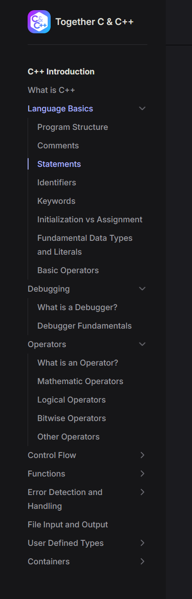

# tccpp.wiki

Repository for the very much work-in-progress website for the Together C & C++ community focusing on tutorials,
resources, and wiki-like content.

Code is under the MIT license, site content is CC BY-SA.

## Table of Contents <!-- omit in toc -->

- [tccpp.wiki](#tccppwiki)
- [Contributing](#contributing)
  - [Getting Started](#getting-started)
  - [Markdown Info](#markdown-info)
  - [Sidebars](#sidebars)
  - [Guidelines](#guidelines)
    - [Editorial Style](#editorial-style)
    - [Code Style](#code-style)

# Contributing

Contributions are welcome!

## Getting Started

Prerequisites: node 18 or newer and ideally make.

To get started: Run `make dev`.

If you do not have make, run `npm i` then `npm run dev`.

The site source is in [src/](src/).

## Markdown Info

The site uses VitePress, which allows for content to easily be written in markdown and custom stuff to be done in Vue.
All normal markdown is supported and VitePress comes with a handful of useful extensions (github note/warning/etc
blocks, line highlighting for code, emojis, math equations, and more). Additionally, we add a few plugins:

- Footnotes
- Custom icons
- Keyboard key formatting

These are good overviews of what vitepress lets you do for markdown pages:

- https://vitepress.dev/guide/markdown
- https://vitepress.dev/guide/asset-handling
- https://vitepress.dev/guide/frontmatter
- https://vitepress.dev/guide/using-vue

An overview of custom markdown formatting for the site can be found at https://tccpp.wiki/resources/wiki-dev/markdown.

A note on formatting: We use prettier for formatting files. Prettier does not understand some custom markdown syntax,
such as custom alert blocks. This can be worked around with newlines, e.g.:

```markdown
> [!NOTE]
>
> Content
```

or

```markdown
::: note

Content

:::
```

## Sidebars

The site relies a lot on sidebars for navigation. When contributing a page, remember to add it to the sidebar. This can
be done by adding it to the `sidebar.ts` (really just a big JSON list) file in the relevant section of the site (e.g.
[`wiki/cpp-tutorial/sidebar.ts`](wiki/cpp-tutorial/sidebar.ts) or
[`wiki/resources/sidebar.ts`](wiki/resources/sidebar.ts)).



## Guidelines

Some guidelines for contribution:

- We use an auto-formatter for markdown files which automatically wraps paragraphs at the column width. We don't do
  things like "semantic line breaks," and if you try to write such the autoformatter will clobber it. Code must be
  formatted manually.
- Run the site locally and test how your contributions look. Make sure everything renders correctly, update formatting
  if needed.

### Editorial Style

- Try to explain things succinctly.
- Mind your audience: If you're contributing beginner-oriented content, try to keep things as simple as possible,
  linking to more advanced topics if needed.
- Headings use
  [Wikipedia Title Case](https://en.wikipedia.org/wiki/Wikipedia:Manual_of_Style/Titles_of_works#Capital_letters). Use
  <https://titlecaseconverter.com/> when in doubt.

### Code Style

For the most part, how to present C++ examples is up to the author. There are a few things to keep in mind though.

You can assume C++20 as a minimum without explicitly pointing it out. For example, you don't need to point out that
`std::span` or `char8_t` are C++20 features. For &ge; C++23 features like `1z`, please mention the standard.

Also, try to maintain consistent style in code. Some very rough points to touch on:

- Most markdown and code on the website has a 120 column limit and this is enforced by the auto-formatter
- Code blocks in markdown should generally not be wider than 80 columns so that they fit without scrolling
- Indent with four spaces
- Braces on the same line, e.g. `int main() {`
- Pointers/references on the left, e.g. `void* ptr`
- Naming:
  - `lower_snake` for most things
  - `Capitalized` for template args
  - `SCREAM_CASE` for macros
- Avoid trailing whitespace on lines. In markdown, prefer `<br/>` over two spaces at the end of a line for a break.
